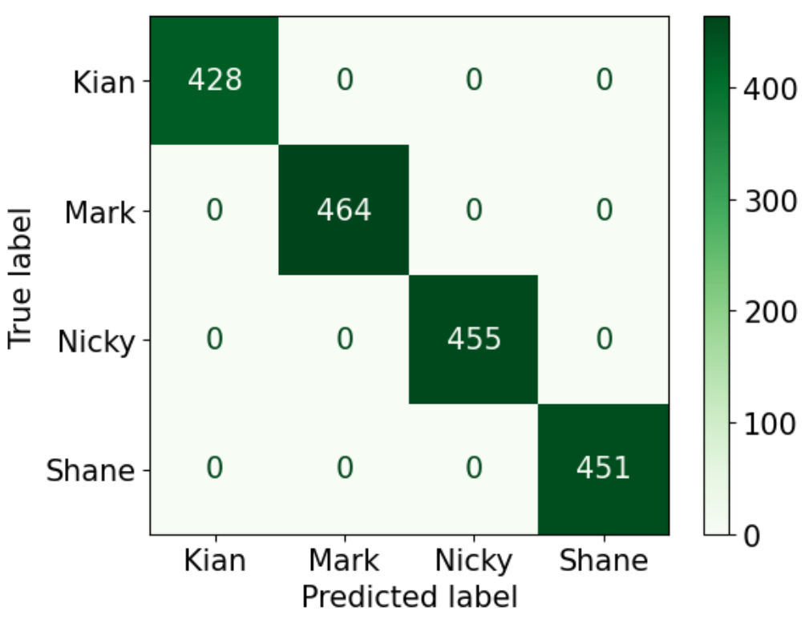
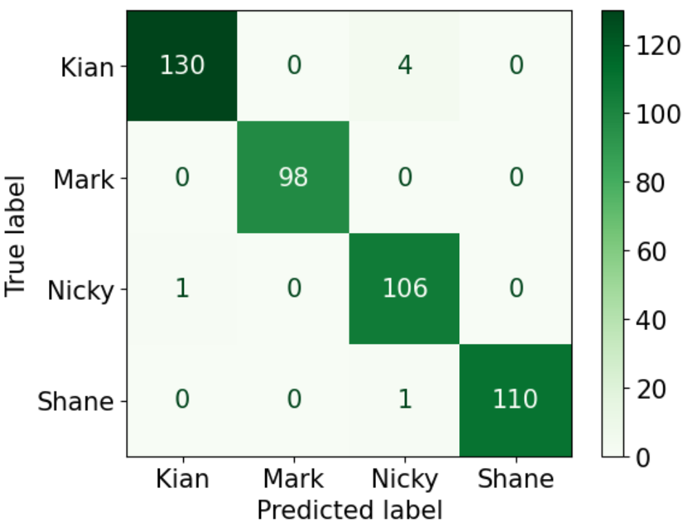

## Multi-Face-Recognition
In this project, I use MTCNN for face detection and VGG16 for face recognition.

## Description
### Face Recognition (MTCNN)
In the realm of computer vision,Face Recognition serves the pivotal role of distinguishing and validating individuals through digital imagery or video snippets, extensively utilized in security infrastructure, biometric verifications, and social media interfaces.

### Calculate Bounding Box Area (Remove Noise Detection)
For some of the false detections, We filtered out these false detections by calculating the bounding box area.

### Face Recognition (VGG16)
VGG16, crafted by the Visual Geometry Group (VGG) at the University of Oxford, stands as a hallmark in the realm of convolutional neural network architectures introduced by Qassim, H., et al. in their paper **Compressed residual-VGG16 CNN model for big data places image recognition**. 

### Classifying Images with VGG16 Using Various Machine Learning Algorithms
We used to classify with 5 machine learning algorithms for classifiation : Logistic Regression, Linear SVM, Neural Network, Gradient Boosting, Nearest Neighbor. 

## Table of Contents
- [Installation](#installation)
- [Author](#author)
- [License](#license)

## Installation
1. Clone the repository:
```
git clone https://github.com/WaiHninEaindrarMg/Multi-Face-Recognition.git
```

2. Install MTCNN :

```
pip install pytorch-mtcnn
```

## Instruction
1. Run this file if you have images https://github.com/WaiHninEaindrarMg/Multi-Face-Recognition/face_detection_image.py 
```
python face_detection_image.py 
```

OR Run this file if you have videos https://github.com/WaiHninEaindrarMg/Multi-Face-Recognition/face_detection_video.py
```
python face_detection_video.py 
```

2. Run this file Train.ipynb
```
Run Train.ipynb
```
In this Train.ipynb , There is vgg16 model with 5 machine learning classifiers.
This is performace plot for train and validation accuracy classify with best performance accuracy model (Logistic_Regression).
The second is Linear_SVM and Neural_Network. 
The third is Gradient Boosting. 
Final one is Nearest Neighbor.
 



3. Run this file face_recognition.py
```
Run face_recognition.py
```
After run this face_recognition.py, video output will be showed.
This is result video for vgg16 model with Linear SVM classification (face recognition result)


##
## Author
👤 : Wai Hnin Eaindrar Mg  
📧 : [waihnineaindrarmg@gmail.com](mailto:waihnineaindrarmg@gmail.com)
👤 : San Chain Tun
📧 : [sanchaintunucsy@gmail.com](mailto:sanchaintunucsy@gmail.com)


## License

This project is licensed under the [MIT License](LICENSE) - see the LICENSE.md file for details.
